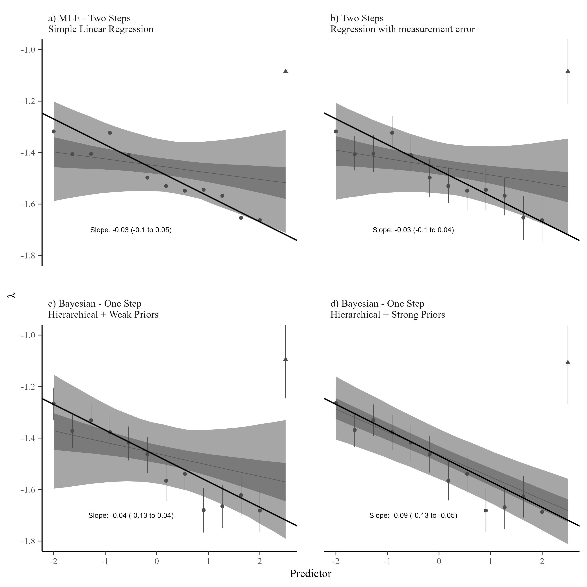

Bayesian hierarchical modeling of size spectra
================

<!-- README.md is generated from README.Rmd. Please edit that file -->

This repository contains code to recreate the analyses in Wesner et
al. *Bayesian hierarchical modeling of size spectra*. The purpose of the
paper is to demonstrate how build Bayesian generalized models using the
truncated Pareto distribution. For a detailed derivation of the
distribution, see Edwards et al. (2017) and Edwards et al. (2020). All
analyses in the paper depend on the `isdbayes` package, which can be
found here: <https://github.com/jswesner/isdbayes>.

## Recreate analyses

All figures and tables in the main text can be recreated by running the
R scripts in the `\code` folder.

The scripts have the following naming convention and function:

**1) figure_X_fit_models.R**: Simulates data and fits models associated
with Figure X in the manuscript.

**2) figure_X_get_posteriors.R**: Wrangles posterior summaries from the
fitted models.

**3) figure_X_make_plots.R**: Creates the figures from the wrangled
posteriors.

When there is minimal wrangling, some of the steps are merged. For
example, `code/get_posteriors_make_plots.R` wrangles the posteriors and
creates the figure below. It shows three modeling approaches (a-d) for
dealing with an outlier in the size spectrum parameter $\lambda$.

All scripts are self-contained. In other words, you can make the plots
without needing to run the models or extract the posteriors, and vice
versa. Posterior summaries are stored in the folder `\posteriors`.

## Needing a cluster

Most of the model scripts will not work on a personal computer. They
require a cluster, because the models are repeatedly fit 1000 times,
resulting in large files. However, fitted models are located in the
`\models` folder. Some of the model fits were too big to upload to
GitHub (e.g., Figures 1-3). Those model fits in the main manusript are
instead stored on Zenodo [here](https://zenodo.org/records/10689765).
Supplementary models are stored
[here](https://zenodo.org/records/10698127). In the posterior scripts,
those models are loaded from the Zenodo urls.

## References

Edwards, A. M., J. P. W. Robinson, J. L. Blanchard, J. K. Baum, and M.
J. Plank. 2020. “Accounting for the Bin Structure of Data Removes Bias
When Fitting Size Spectra.” *Marine Ecology Progress Series* 636
(February): 19–33. <https://doi.org/10.3354/meps13230>.

Edwards, A. M., J. P. W. Robinson, M. J. Plank, J. K. Baum, and J. L.
Blanchard. 2017. “Testing and Recommending Methods for Fitting Size
Spectra to Data.” *Methods in Ecology and Evolution* 8 (1): 57–67.
<http://dx.doi.org/10.1111/2041-210X.12641>.

